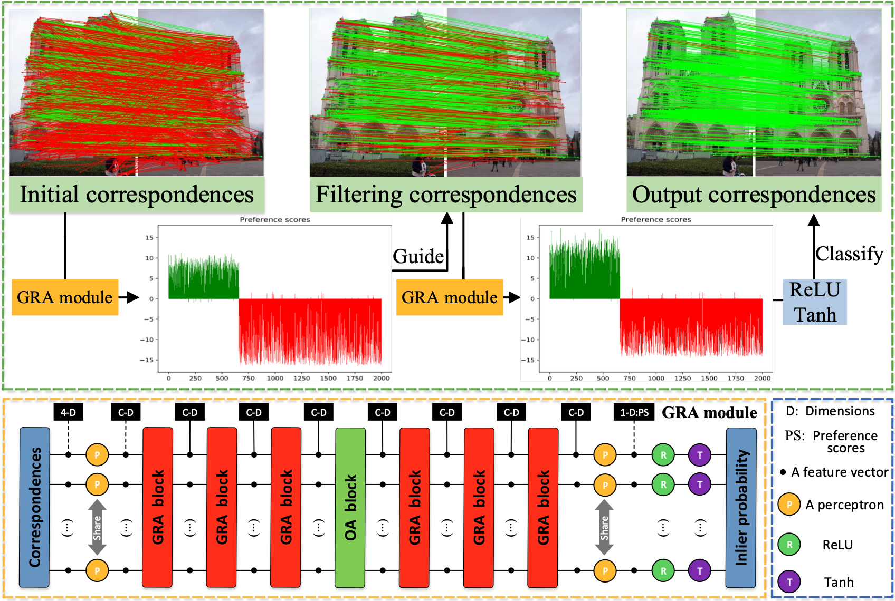

# PGFNet
PGFNet: Preference-Guided Filtering Network for Two-View Correspondence Learning

# PGFNet implementation
Pytorch implementation of PGFNet

## Abstract


Accurate correspondence selection between two images is of great importance for numerous feature matching based vision tasks. The initial correspondences established by off-the-shelf feature extraction methods usually contain a large number of outliers, and this often leads to the difficulty in accurately and sufficiently capturing contextual information for the correspondence learning task. In this paper, we propose a Preference-Guided Filtering Network (PGFNet) to address this problem. The proposed PGFNet is able to effectively select correct correspondences and simultaneously recover the accurate camera pose of matching images. Specifically, we first design a novel iterative filtering structure to learn the preference scores of correspondences for guiding the correspondence filtering strategy. This structure explicitly alleviates the negative effects of outliers so that our network is able to capture more reliable contextual information encoded by the inliers for network learning. Then, to enhance the reliability of preference scores, we present a simple yet effective Grouped Residual Attention block as our network backbone, by designing a feature grouping strategy, a feature grouping manner, a hierarchical residual-like manner and two grouped attention operations. We evaluate PGFNet by extensive ablation studies and comparative experiments on the tasks of outlier removal and camera pose estimation. The results demonstrate outstanding performance gains over the existing state-of-the-art methods on different challenging scenes. 

## Requirements

Please use Python 3.6, opencv-contrib-python (3.4.0.12) and Pytorch (>= 1.1.0). Other dependencies should be easily installed through pip or conda.

## Explanation

If you need YFCC100M and SUN3D datasets, You can visit the code at https://github.com/zjhthu/OANet.git. We have uploaded the main code on 'core' folder. 

# Citing PGFNet
If you find the PGFNet code useful, please consider citing:

```bibtex
@article{liu2023pgfnet,
  title={Pgfnet: Preference-guided filtering network for two-view correspondence learning},
  author={Liu, Xin and Xiao, Guobao and Chen, Riqing and Ma, Jiayi},
  journal={IEEE Transactions on Image Processing},
  volume={32},
  pages={1367--1378},
  year={2023},
  publisher={IEEE}
}
```  
